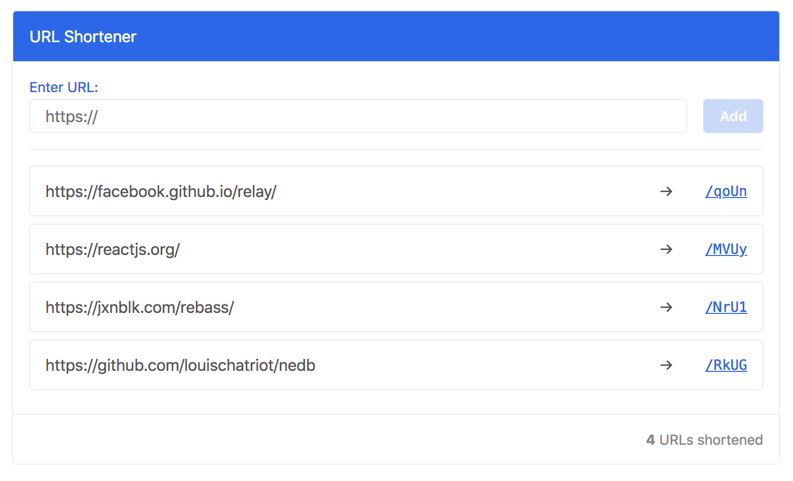

# A URL Shortener

> An example app of Relay Modern and others



## Frameworks

- Framework: [Relay](https://facebook.github.io/relay/)
- Client: [React](https://reactjs.org/) + [Rebass](https://jxnblk.com/rebass/)
- Schema: [GraphQL](https://graphql.org/graphql-js/) + [Relay](https://github.com/graphql/graphql-relay-js)
- Server: [Express-GraphQL](https://github.com/graphql/express-graphql)
- Database: [NeDB](https://github.com/louischatriot/nedb)

Shortened URLs are generated using [hashids](https://hashids.org/).

## Get Started

### Install

Install dependencies:

```
yarn install
```

### Build

Generate a GraphQL schema file:

```
yarn update-schema
```

Compile GraphQL queries for Relay:

```
yarn compile
```

### Run Dev Server

Start a local API server:

```
yarn serve
```

The API server can be accessed at <http://localhost:3000>. And you can visit
the GraphiQL console at <http://localhost:3000/graphql>.

Alongside the API server, start WebPack development server:

```
yarn start
```

The Web app can be accessed at <http://localhost:8080>.

### Build and Run Production Server

Build static resources:

```
yarn build
```

Start server in production mode:

```
NODE_ENV=production yarn serve
```

The server can be accessed at <http://localhost:3000>.

## Lint and Testing

Run ESLint:

```
yarn lint
```

Run Flow type checker:

```
yarn flow check
```

Run unit tests:

```
yarn test
```

## Folder Structure

    .
    ├── dist                    # Compiled files
    ├── public                  # Static asset files
    ├── src                     # Source files
    │   ├── client              # Code for web app
    │   ├── data                # Code for database and GraphQL schema
    │   └── server              # Code for server
    ├── tools                   # Scripts and utilities
    ├── package.json
    └── README.md

## Limitations

- There is no user authentication.
- The UI currently only displays 10 shortened URLs (no pagination).
- No other metadata is saved except for the URL.

## TODOs

- [ ] Persist database in file system.
- [ ] Setup environmental configs.
- [ ] Add testing for GraphQL server.
- [ ] Add testing for React components.
- [ ] Detect duplicated URLs.

## License

[MIT © Sirui Li](LICENSE.md)
